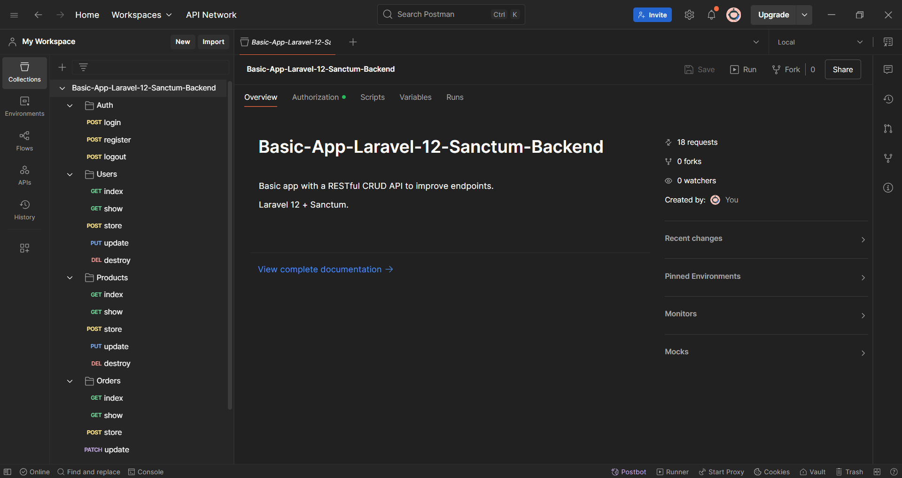
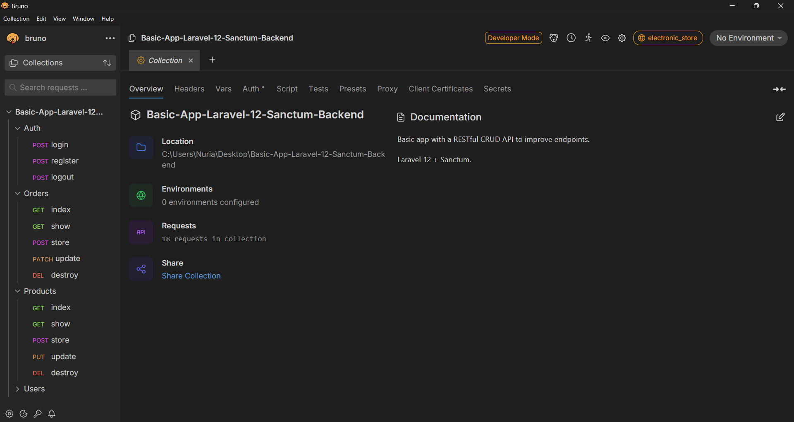
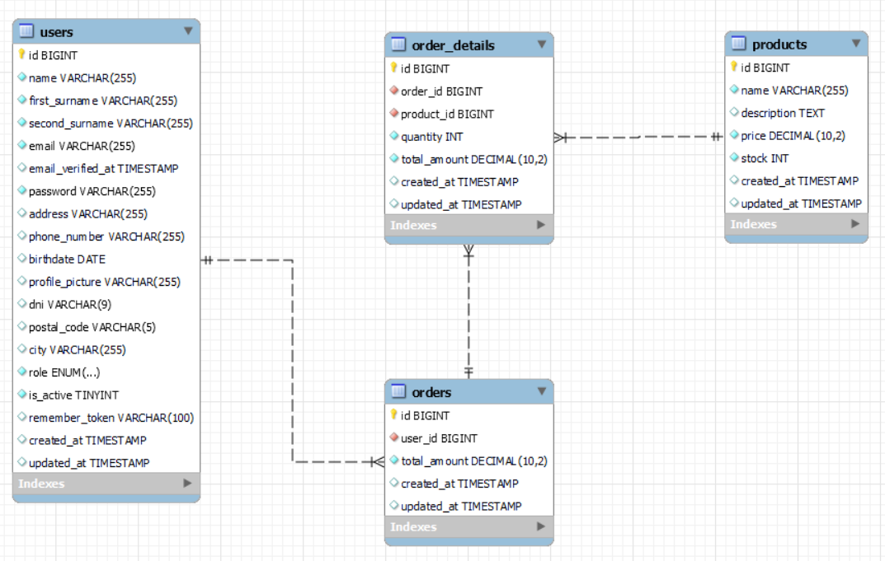
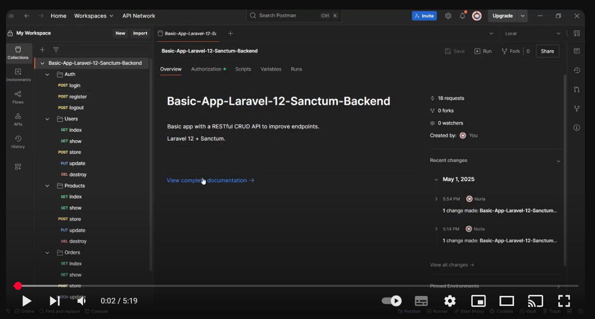

# Basic App Laravel 12 Sanctum (Backend)

📘 Disponible también en [Español](./README.es.md)

Upgraded app to Laravel 12 and added new features, including tests.

This application has been developed with Laravel, it offers CRUD operations and a basic authentication and registration system.

  

## Environment 🛠️

* [PHP 8.2.4](https://www.php.net/releases/8_2_4.php)

* [Laravel 12](https://laravel.com/docs/12.x)

* [Laravel Sanctum](https://laravel.com/docs/11.x/sanctum#main-content)

* API

* Test

* CRUD

* MySQl

* Postman or Bruno

* Visual Studio Code

  

## Installation ⚙️

1. Clone this repository to your local machine using `git clone https://github.com/nuriadevs/basic-app-laravel-12-sanctum-backend`.

  

2. Install PHP dependencies using Composer with `composer install`.

  

3. Copy the `.env.example` configuration file and set it up with your environment and `.env` file.

  

4. Generate an application key with `php artisan key:generate`.

  

5. Configure your database in the `.env` file.

  

6. Run migrations with `php artisan migrate`.

  

7. Run seeds for data with `php artisan db:seed`.

  

8. Start the development server with `php artisan serve`.

  

9. Access the application in your web browser at [http://localhost:8000](http://localhost:8000).

## API endpoints

  

| Endpoint         | **Methods** | Routes                    |
|------------------|-------------|---------------------------|
| **Authentication** |             |                           |
| Login            | POST        | api/auth/login            |
| Register         | POST        | api/auth/register         |
| Logout           | POST        | api/auth/logout           |
| **Users**        |             |                           |
| Index            | GET         | api/users                 |
| Show             | GET         | api/users/{user}          |
| Store            | POST        | api/users                 |
| Update           | PATCH       | api/users/{user}          |
| Destroy          | DELETE      | api/users/{user}          |
| **Products**     |             |                           |
| Index            | GET         | api/products              |
| Show             | GET         | api/products/{product}    |
| Store            | POST        | api/products              |
| Update           | PATCH       | api/products/{product}    |
| Destroy          | DELETE      | api/products/{product}    |
| **Orders**       |             |                           |
| Index            | GET         | api/orders                |
| Show             | GET         | api/orders/{order}        |
| Store            | POST        | api/orders                |
| Update           | PATCH       | api/orders/{order}        |
| Destroy          | DELETE      | api/orders/{order}        |

 
## Environment Variables

Visit `.env.example` to create  the environments.

## Demo Postman :man_astronaut:

## Demo Bruno :dog:

## Database schema

## Watch video 

You can watch the test in Postman of the restful API on this link  [Wath video](https://youtu.be/RxrGRVwGSak)

## Links 
- [Laravel](https://laravel.com/docs/12.x/releases)
- [Bruno](https://www.usebruno.com/)
- [Postman](https://www.postman.com/)
- [PHP](https://www.php.net/)
  

## Summary

-   Don't forget to create your own .env file for the variables.
- You can create your own data without running the seeder.
-   This project is under construction...can be improved.

## Thanks 🍀

Thank you very much for reading this project.
